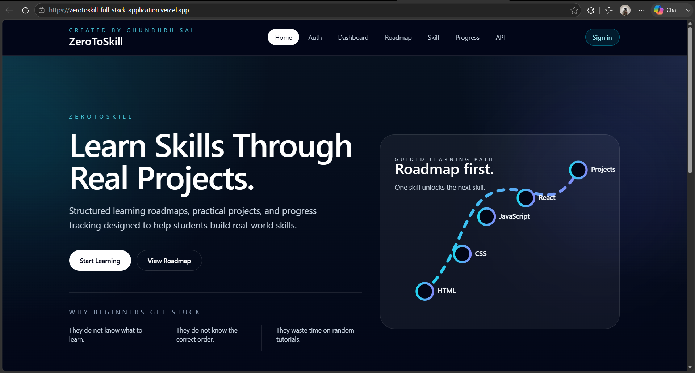
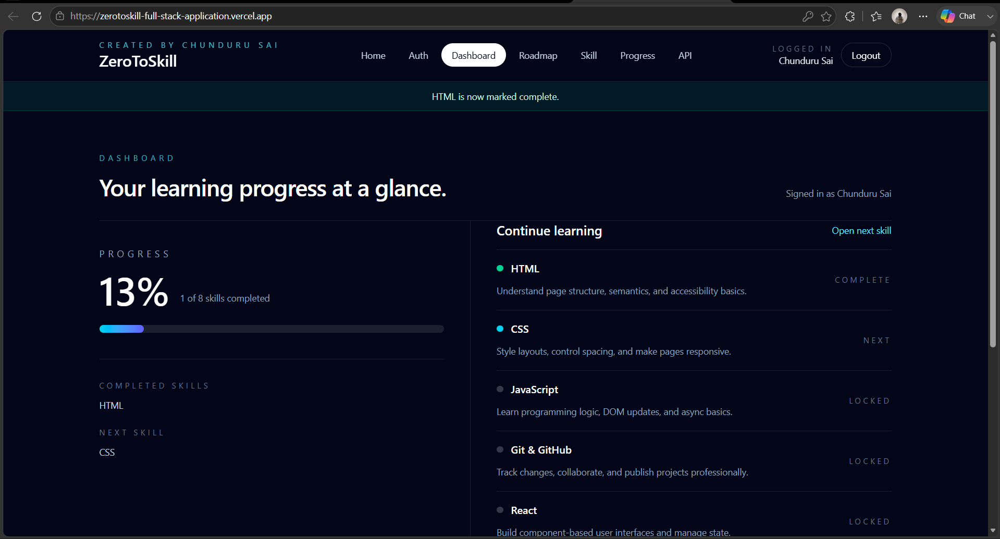
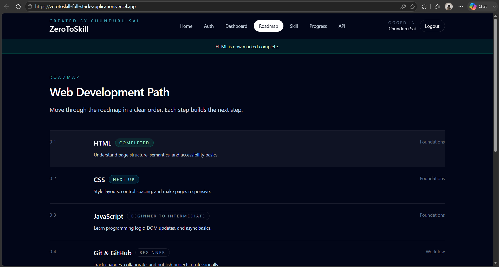

# 🚀 ZeroToSkill

Start from Zero. Become Job Ready.

ZeroToSkill is a full-stack learning platform designed to help beginners become job-ready developers through structured learning paths, skill tracking, and guided roadmaps.

## 🌐 Live Demo

https://zerotoskill-full-stack-application.vercel.app

## 📖 About The Project

Many students struggle because they:

* Don't know what to learn
* Don't know the correct learning order
* Waste time switching between random tutorials
* Lack proper guidance and progress tracking

ZeroToSkill solves these problems through structured roadmaps, progress tracking, and beginner-friendly learning paths.

## ✨ Features

* User Registration & Login
* JWT Authentication
* Learning Roadmaps
* Skill Tracking System
* Progress Dashboard
* Completed Skills Tracking
* Next Skill Recommendations
* Responsive User Interface
* Beginner-Friendly Design

## 📚 Learning Paths

### Web Development

* HTML
* CSS
* JavaScript
* Git & GitHub
* React
* Backend Development
* MySQL
* Projects

### Java Full Stack

### Python Development

## 🛠️ Tech Stack

### Frontend

* React.js
* Vite
* TypeScript

### Backend

* Node.js
* Express.js

### Database

* MySQL

### Authentication

* JWT
* bcrypt

## 📸 Screenshots

### Home Page



### Dashboard



### Roadmap



## 🚀 Installation

Clone the repository:

```bash
git clone https://github.com/saichunduru5/zerotoskill-full-stack-application.git
```

Move into the project directory:

```bash
cd zerotoskill-full-stack-application
```

Install dependencies:

```bash
npm install
```

Run frontend:

```bash
npm run dev
```

Run backend:

```bash
node server/index.js
```

Build for production:

```bash
npm run build
```

## 🔐 API Endpoints

### Authentication

* POST /auth/register
* POST /auth/login

### Skills

* GET /skills
* GET /skills/:id

### Progress

* GET /progress
* POST /progress

## 🎯 Future Improvements

* Learning Streak System
* Certificates
* Admin Dashboard
* Community Discussions
* AI Learning Assistant

## 👨‍💻 Developer

**Chunduru Sai**

GitHub: https://github.com/saichunduru5

## 📌 Repository

https://github.com/saichunduru5/zerotoskill-full-stack-application

## 📄 License

This project is developed for educational and portfolio purposes.
